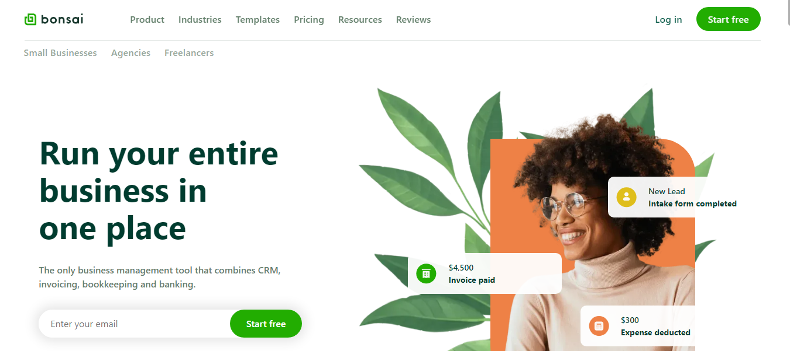

# Bonsai Clone With Bootstrap and JavaScript

This project is a clone of the Bonsai official website having a total of 10 pages
- Home page
- Pricing
- small business page
- Agencies page
- Freelancers page
- Contracts page
- Collaboration page
- Payments
- Consulting
- Coaching

## Screenshot

## Links

- Live Site URL: [Vercel](https://getlinked-mu.vercel.app/)

## Built With

- Semantic HTML5 markup
- Bootstrap
- Sass
- JavaScript
- Mobile-first workflow

## Author

- LinkedIn - [@JeremiahChinwe](https://www.linkedin.com/in/jeremiah-chinwe-057180268)
- Twitter - [@jeremiahchinwe](https://www.twitter.com/jeremiahchinwe)

